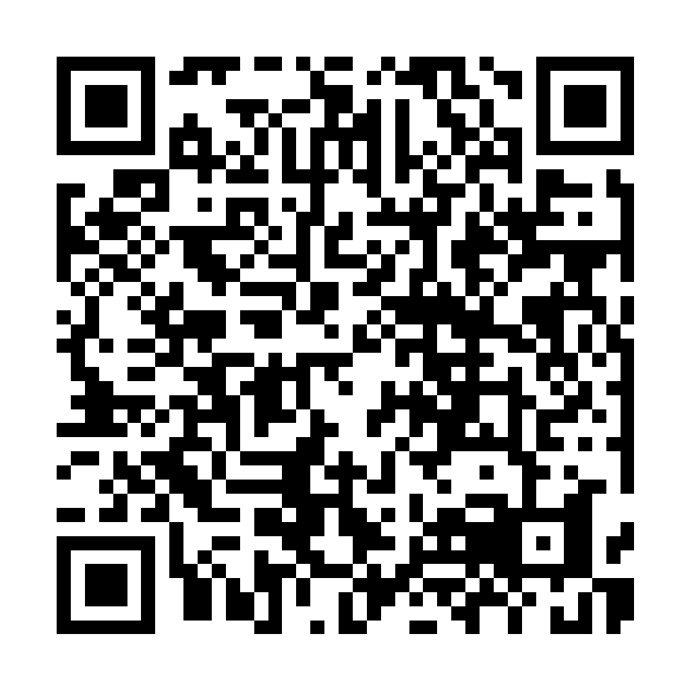

# Visual Studio Live! San Diego 2026 — session slides

Slides for the two sessions this repository accompanies, by Alon Fliess. Like the
[companion book](companion-book.md), the decks are published as **release assets**, not tracked files:
the conference version of each deck is attached to the `vslive-san-diego-2026` release and is never
replaced in place, so a link photographed from the screen today still opens the same deck later.

| Session | When | Slides (PDF) | Go deeper |
| --- | --- | --- | --- |
| **W20** — The Agentic Revolution: From Code Builders to System Rulers | Wed, Sep 16, 2026 | [VSLive-SanDiego-2026-W20.pdf](https://github.com/alonf/CaesariaAgenticArchitectureDemo/releases/download/vslive-san-diego-2026/VSLive-SanDiego-2026-W20.pdf) | [companion book](companion-book.md) · [Specrew](https://github.com/alonf/specrew) · [session page](https://vslive.com/events/san-diego-2026/sessions/wednesday/w20-agentic-revolution.aspx) |
| **H08** — Developing Agentic Systems in .NET: From Concept to Code | Thu, Sep 17, 2026 | [VSLive-SanDiego-2026-H08.pdf](https://github.com/alonf/CaesariaAgenticArchitectureDemo/releases/download/vslive-san-diego-2026/VSLive-SanDiego-2026-H08.pdf) | [demo stages](../README.md#the-cumulative-demo-stages) · [runbooks](runbooks/) · [session page](https://vslive.com/events/san-diego-2026/sessions/thursday/h08-agentic-systems.aspx) |

Both decks were published on 2026-09-16, ahead of the sessions, so the links above are live. The decks
are keyframes: the narration, the live Caesarea demo and the reasoning behind each build step are what
the sessions add.

## The one QR code

Both decks carry the same QR code, on the opening "you don't need to copy the screen" slide and on the
closing resources slide. It points at the **repository root**, not at a deck: the README is the permanent
landing page for the slides, the code, the book and everything added later, so the printed URL never has
to change.



Encodes `https://github.com/alonf/CaesariaAgenticArchitectureDemo` (error-correction level H, verified
by decoding the PNG). Files: [`qr-caesarea-repo.png`](presentations/qr-caesarea-repo.png) (1024 px) and
[`qr-caesarea-repo.svg`](presentations/qr-caesarea-repo.svg) (vector, for the deck). Suggested slide
label: **Demo code, slides & resources**.

## Publishing the decks (presenter runbook)

1. Export each deck to PDF with the exact names `VSLive-SanDiego-2026-W20.pdf` and
   `VSLive-SanDiego-2026-H08.pdf`.
2. Create the release once, attaching whichever deck is due; add the second deck to the same release
   the next day:

   ```powershell
   gh release create vslive-san-diego-2026 .\VSLive-SanDiego-2026-W20.pdf `
     --title "Visual Studio Live! San Diego 2026 - session slides" `
     --notes "Conference versions of the W20 and H08 decks. See docs/presentations.md."
   gh release upload vslive-san-diego-2026 .\VSLive-SanDiego-2026-H08.pdf
   ```

3. Record each deck's SHA-256 below so a download can be verified, as with the book:

   ```powershell
   (Get-FileHash .\VSLive-SanDiego-2026-W20.pdf -Algorithm SHA256).Hash
   ```

| Deck | Pages | Published | SHA-256 |
| --- | --- | --- | --- |
| VSLive-SanDiego-2026-W20.pdf | 51 | 2026-09-16 | `9927edfc42688018b5defeeb8dc95eb70ff03c8fcdf3300e3d502242d31c12a7` |
| VSLive-SanDiego-2026-H08.pdf | 59 | 2026-09-16 | `1adb7953e203f2005cc8a3cde45bc32bc35990242f74cfd66f696f509fe1989b` |

A corrected deck is a new asset name (for example `...-W20-r2.pdf`) on the same release, with the table
updated — never an in-place replacement.

## Terms

The decks are © 2026 Alon Fliess. They may be downloaded and shared unmodified, free of charge, with the
author's name intact; any other use requires written permission. Product names and trademarks belong to
their respective owners. The code in this repository stays under the [MIT License](../LICENSE).
